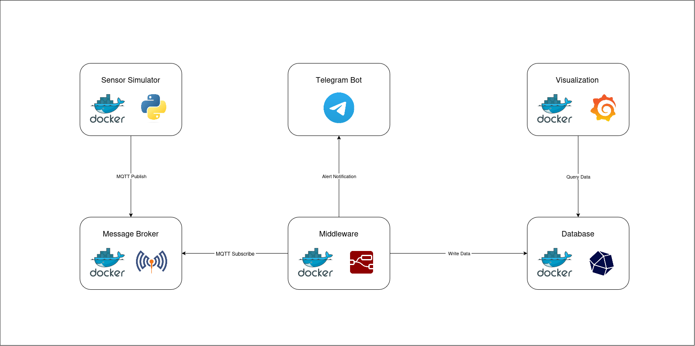
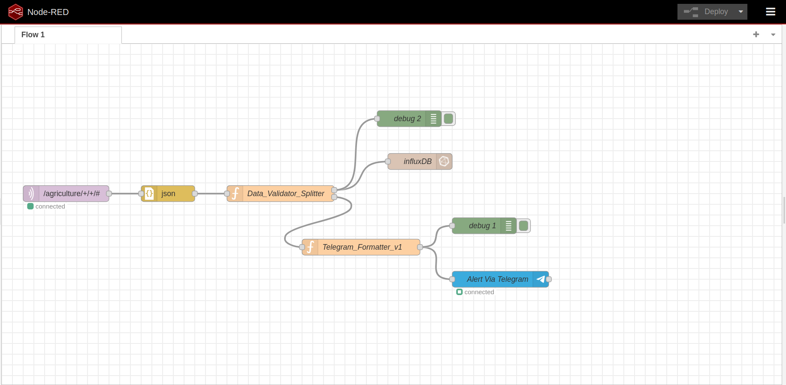
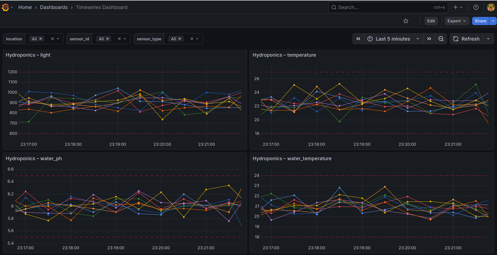
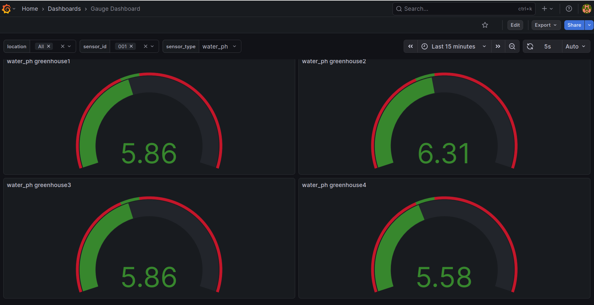

# Smart Hydroponics IoT System

An end-to-end **IoT system for hydroponics** using MQTT, Node-RED, InfluxDB, Grafana, and Alert Telegram notifications. This system simulates hydroponic sensors, collects, processes, stores, and visualizes sensor data in real time.

---

## Project Overview

This IoT project simulates hydroponic sensor data such as:

- Air Temperature
- Humidity
- Water pH
- Water Temperature
- EC
- Light

**Key features:**

- MQTT-based sensor simulation and communication
- Node-RED middleware for data processing and alerting
- InfluxDB time-series storage
- Grafana dashboard visualization
- Telegram alerts for threshold violations
- Fully Dockerized deployment

---

# System Architecture



# Nodered Flow

---

## Getting Started

Clone the repository and navigate into the project directory:

```bash
git clone https://github.com/tesfawe/se4iot_hydroponics_project.git
cd se4iot_hydroponics_project
```

Copy `.env.example` to `.env` and fill in the values.
If you are not sure how to get your Telegram bot token and Telegram chat ID, [go to Telegram Alerts](#telegram-alerts).


Start all services with Docker Compose:

```bash
docker-compose up -d --build
```
---

### Optional Simulator Commands

```bash
# Build without starting
docker-compose build simulator

# Build and start
docker-compose up -d --build simulator

# Using manual profile
docker-compose --profile manual stop simulator
docker-compose --profile manual rm -f simulator
docker-compose --profile manual build simulator
docker-compose --profile manual create simulator
docker-compose --profile manual start simulator
```

---

## Node-RED Setup

Ensure proper permissions (only if necessary):

```bash
sudo chown -R 1000:1000 ./node-red/data
sudo chmod -R u+rw ./node-red/data
```
---

## Grafana Setup

Ensure permissions (only if necessary):

```bash
sudo chown -R 472:472 ./grafana
sudo chmod -R u+rw ./grafana
```

---

## Testing with MQTT Explorer

Subscribe to topics such as:

```
/agriculture/greenhouse2/water_ph/002
```

Sample payload:

```json
{
  "value": 10,
  "timestamp": 1765301542827,
  "location": "greenhouse2",
  "sensor_id": "002"
}
```

**Important Notes:**

- Use proper **QoS** and **Retain** flags
- Prefer sending timestamps from the simulator rather than letting InfluxDB set `now()`
- Invalid timestamps (future or too far past) may break visualization

---

## Telegram Alerts

### 1. Create a Bot

1. Open **Telegram** and search for **@BotFather**
2. Start a chat with it and send the command `/newbot`
3. Follow the prompts to:
   - choose a display name for your bot
   - choose a **unique username** (must end with `bot`)
4. When BotFather finishes, it will show you an **HTTP API token**
5. **Copy and save this token** - you will need it for configuration


### 2. Get Your Chat ID

1. Start a conversation with your bot (send any message)
2. Visit:  
```
https://api.telegram.org/bot<YOUR_BOT_TOKEN>/getUpdates
```
3. Copy the value of `result.chat.id` from JSON response

### 3. Configure Environment Variables

- Update the following variables in your `.env` file with your own values:

  - TELEGRAM_BOT_TOKEN=your_bot_token_here
  - TELEGRAM_CHAT_ID=your_chat_id_here


### 4. Node-RED Configuration

- Configure Telegram Sender node (`Alert Via Telegram` node):
  - Name: `MyHydroponicsBot` (Replace it with your own)
  - Token: `${TELEGRAM_BOT_TOKEN}`

---

## Docker Commands Summary

- Start all services:

```bash
docker-compose up -d --build
```

- Node-RED / Grafana permissions (only if necessary):

```bash
sudo chown -R 1000:1000 ./node-red/data
sudo chmod -R u+rw ./node-red/data

sudo chown -R 472:472 ./grafana
sudo chmod -R u+rw ./grafana
```

---

## Important Note on Credentials & Security

This project was developed for **academic and local demonstration purposes** as part of the *Software Engineering for the Internet of Things* course.

To ensure the system can be easily executed and evaluated, **default credentials and tokens are included in the configuration files**. These credentials are intended **only for local testing** and **must not be used in production environments**.

All services run on `localhost` and are **not exposed to public networks**.

### For Real-World Deployments
- Credentials should be stored using **environment variables** or **secret management tools**
- Authentication details should **never be committed to version control**
- Network access should be **restricted and secured**

---

# Examples from Grafna Dashboards
## Time series Dashboard


## Gauge Dashboard



